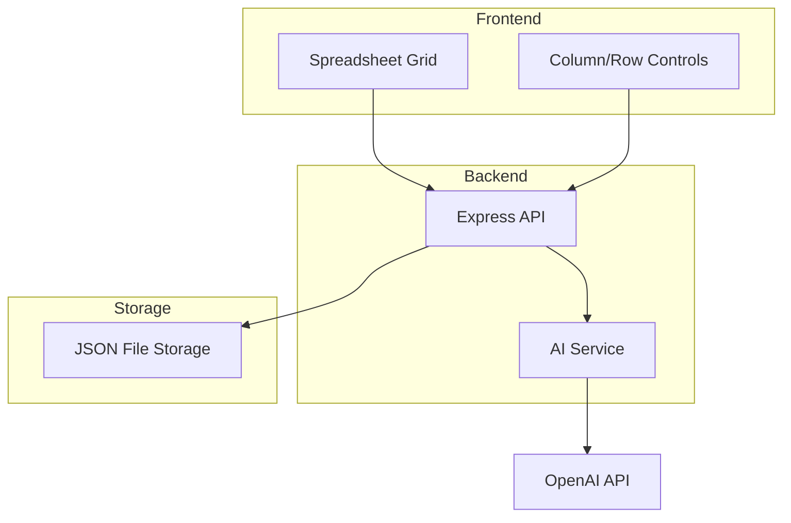

# Design Document

## Overview

TabularSearch Prototype is designed as a minimal web application with a React frontend and simple backend, focusing purely on the core concept: a spreadsheet-like interface where AI can populate cells based on column definitions and row context. This prototype validates the core user experience without external integrations.

## Prototype Scope

**Included in Prototype:**

- Basic spreadsheet-like grid interface
- Column definition with field types and descriptions
- Row context input (research subject)
- AI-powered cell population using LLM only
- Simple table persistence

**Deferred to Later Versions:**

- Web search integration
- Source citations and transparency
- Multiple data sources
- Export functionality
- User management
- All advanced features

## Architecture

### Prototype Architecture (Ultra-Simplified)



### Technology Stack (Prototype)

**Frontend:**

- React with basic hooks (useState, useEffect)
- ag-grid-react for professional spreadsheet interface
- axios for API calls
- Basic CSS for custom styling

**Backend:**

- Node.js with Express
- OpenAI API integration
- JSON file storage (no database)
- CORS for frontend communication

**Key Libraries:**

- `ag-grid-react` - Professional grid component with editing
- `openai` - Official OpenAI SDK
- `express` - Simple REST API
- `uuid` - Generate unique IDs
- `axios` - HTTP client

**Key Simplifications:**

- No TypeScript (plain JavaScript)
- No complex state management
- No authentication
- No real-time updates
- Single table support
- File-based persistence

- `ag-grid-react` - Professional grid component with editing
- `openai` - Official OpenAI SDK
- `express` - Simple REST API
- `uuid` - Generate unique IDs
- `axios` - HTTP client

**Key Simplifications:**

- No TypeScript (plain JavaScript)
- No complex state management
- No authentication
- No real-time updates
- Single table support
- File-based persistence

## Components and Interfaces

### Frontend Components

#### TableGrid Component

```javascript
function TableGrid({ table, onCellResearch, onCellUpdate }) {
  // Simple table rendering with editable cells
  // Click to research functionality
  // Loading states for individual cells
}
```

#### ColumnEditor Component

```javascript
function ColumnEditor({ columns, onColumnAdd, onColumnUpdate }) {
  // Add/edit column definitions
  // Set column types and descriptions
}
```

#### RowControls Component

```javascript
function RowControls({ onRowAdd, onRowDelete }) {
  // Add/remove rows
  // Set row context (research subject)
}
```

### Backend API

#### Core Endpoints

```javascript
// GET /api/table - Get current table data
// POST /api/table - Save table data
// POST /api/research - Research a specific cell
// GET /api/health - Health check
```

#### Research Service

```javascript
async function researchCell(columnDef, rowContext, currentValue) {
  const prompt = `
    You are helping with research. 
    Column: ${columnDef.name} (${columnDef.description})
    Research Subject: ${rowContext}
    
    Provide a concise answer for this field.
  `;

  const response = await openai.chat.completions.create({
    model: "gpt-3.5-turbo",
    messages: [{ role: "user", content: prompt }],
  });

  return response.choices[0].message.content;
}
```

## Data Models

### Simple Data Structure

```javascript
// Table structure stored in JSON
const table = {
  id: "table-1",
  name: "My Research Table",
  columns: [
    {
      id: "col-1",
      name: "Company Name",
      type: "text",
      description: "Name of the company",
    },
    {
      id: "col-2",
      name: "Founded Year",
      type: "number",
      description: "Year the company was founded",
    },
  ],
  rows: [
    {
      id: "row-1",
      context: "Apple Inc",
      cells: {
        "col-1": { value: "Apple Inc.", status: "completed" },
        "col-2": { value: "1976", status: "completed" },
      },
    },
  ],
};
```

### Cell States

```javascript
const cellStates = {
  EMPTY: "empty",
  RESEARCHING: "researching",
  COMPLETED: "completed",
  ERROR: "error",
};
```

## User Interface Design

### Layout

- Simple header with table name
- Column headers with edit buttons
- Grid of cells with click-to-research functionality
- Add row/column buttons
- Basic loading indicators

### User Flow

1. User creates/opens a table
2. User defines columns (name, type, description)
3. User adds rows with research context
4. User clicks cells to trigger AI research
5. AI populates cell based on column definition and row context
6. User can manually edit results if needed

## Error Handling

### Simple Error Categories

- API connection errors
- OpenAI API errors
- Invalid input data
- File storage errors

### Error Display

- Simple alert messages
- Cell-level error indicators
- Retry buttons for failed research

## Testing Strategy

### Manual Testing Focus

- Core user workflow testing
- AI response quality validation
- Basic error scenario testing
- Cross-browser compatibility

### Minimal Automated Testing

- API endpoint testing
- Basic component rendering tests

## Deployment

### Simple Deployment

- Single server deployment
- Environment variables for OpenAI API key
- Static file serving for frontend
- JSON file storage in server directory

This ultra-simplified design focuses purely on validating the core concept with minimal complexity, allowing for rapid prototyping and iteration.
